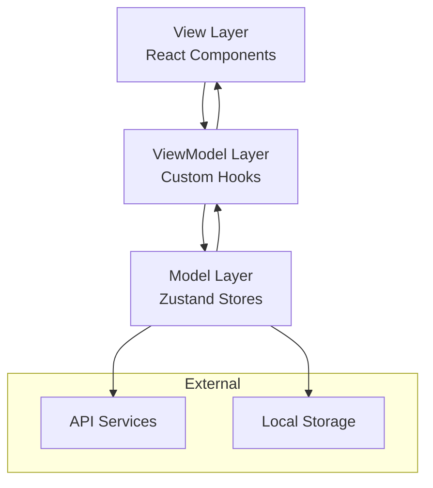

# 资源下载站开发指南

## 目录
1. [项目架构](#项目架构)
2. [开发环境设置](#开发环境设置)
3. [目录结构](#目录结构)
4. [技术栈详解](#技术栈详解)
5. [开发规范](#开发规范)
6. [组件设计原则](#组件设计原则)
7. [状态管理](#状态管理)
8. [样式系统](#样式系统)
9. [构建和部署](#构建和部署)

## 项目架构

### MVVM架构设计
本项目采用 **Model-View-ViewModel (MVVM)** 架构模式：

- **Model层**: 使用 Zustand 进行状态管理，包含业务数据和逻辑
- **View层**: React 组件，负责UI渲染和用户交互
- **ViewModel层**: 自定义 Hooks，连接 Model 和 View，处理业务逻辑



### 模块化设计
项目按功能模块划分，确保高内聚低耦合：

1. **认证模块** - 用户登录、注册、权限管理
2. **资源模块** - 资源展示、搜索、分类、详情
3. **用户中心模块** - 个人信息、订单、下载记录
4. **支付模块** - 购物车、订单、支付、VIP
5. **交互模块** - 评论、评分、收藏、分享

## 开发环境设置

### 系统要求
- Node.js 18+ 
- npm 或 yarn 或 pnpm
- Git
- VS Code (推荐)

### 安装依赖
```bash
# 克隆项目
git clone <repository-url>
cd ziyuanba

# 安装依赖
npm install

# 启动开发服务器
npm run dev
```

### 推荐的VS Code扩展
```json
{
  "recommendations": [
    "bradlc.vscode-tailwindcss",
    "esbenp.prettier-vscode",
    "ms-vscode.vscode-typescript-next",
    "ms-vscode.vscode-eslint",
    "formulahendry.auto-rename-tag",
    "christian-kohler.path-intellisense"
  ]
}
```

## 目录结构

```
src/
├── app/                          # Next.js App Router
│   ├── (auth)/                  # 认证页面组
│   │   ├── login/
│   │   ├── register/
│   │   └── layout.tsx
│   ├── (dashboard)/             # 用户中心页面组
│   │   ├── profile/
│   │   ├── downloads/
│   │   ├── orders/
│   │   └── layout.tsx
│   ├── (shop)/                  # 商店页面组
│   │   ├── resources/
│   │   ├── category/
│   │   ├── cart/
│   │   └── layout.tsx
│   ├── api/                     # API路由 (如需要)
│   ├── globals.css
│   ├── layout.tsx
│   └── page.tsx
│
├── components/                   # 可复用组件
│   ├── ui/                      # 基础UI组件
│   │   ├── Button/
│   │   ├── Input/
│   │   ├── Modal/
│   │   ├── Card/
│   │   └── index.ts
│   ├── layout/                  # 布局组件
│   │   ├── Header/
│   │   ├── Footer/
│   │   ├── Sidebar/
│   │   ├── MainLayout/
│   │   └── index.ts
│   ├── forms/                   # 表单组件
│   │   ├── LoginForm/
│   │   ├── SearchForm/
│   │   ├── PaymentForm/
│   │   └── index.ts
│   └── features/                # 功能组件
│       ├── ResourceCard/
│       ├── ResourceList/
│       ├── CommentSection/
│       ├── DownloadManager/
│       └── index.ts
│
├── lib/                         # 工具库
│   ├── hooks/                   # 自定义Hooks
│   │   ├── useAuth.ts
│   │   ├── useResources.ts
│   │   ├── useCart.ts
│   │   └── index.ts
│   ├── utils/                   # 工具函数
│   │   ├── format.ts
│   │   ├── validation.ts
│   │   ├── api.ts
│   │   └── index.ts
│   ├── validators/              # 验证模式
│   │   ├── auth.ts
│   │   ├── resource.ts
│   │   └── index.ts
│   └── constants/               # 常量定义
│       ├── config.ts
│       ├── routes.ts
│       └── index.ts
│
├── stores/                      # Zustand状态管理
│   ├── authStore.ts
│   ├── resourceStore.ts
│   ├── cartStore.ts
│   ├── uiStore.ts
│   └── index.ts
│
├── types/                       # TypeScript类型定义
│   ├── auth.ts
│   ├── resource.ts
│   ├── payment.ts
│   ├── api.ts
│   └── index.ts
│
└── styles/                      # 样式文件
    ├── components.css
    └── utilities.css
```

## 技术栈详解

### Next.js 15 (App Router)
- **服务端渲染 (SSR)**: 提升SEO和首屏加载性能
- **静态生成 (SSG)**: 静态资源页面预生成
- **增量静态再生 (ISR)**: 动态更新静态内容
- **API路由**: 内置API功能 (可选)

### TypeScript 5+
```typescript
// 类型定义示例
interface Resource {
  id: string;
  title: string;
  description: string;
  type: 'video' | 'software' | 'document' | 'article' | 'file';
  category: string;
  price: number;
  thumbnail: string;
  downloadUrl: string;
  author: {
    id: string;
    name: string;
    avatar?: string;
  };
  stats: {
    downloads: number;
    views: number;
    rating: number;
    reviewCount: number;
  };
  createdAt: string;
  updatedAt: string;
}
```

### Tailwind CSS 4
```css
/* 自定义主题配置 */
@tailwind base;
@tailwind components;
@tailwind utilities;

@theme {
  --color-primary: 59 130 246;
  --color-secondary: 156 163 175;
  --color-accent: 34 197 94;
  --color-danger: 239 68 68;
  --color-warning: 245 158 11;
}

/* 组件样式 */
.resource-card {
  @apply bg-white rounded-lg shadow-md hover:shadow-lg transition-shadow duration-200;
}
```

### Zustand状态管理
```typescript
// stores/resourceStore.ts
import { create } from 'zustand';
import { devtools, persist } from 'zustand/middleware';

interface ResourceStore {
  resources: Resource[];
  loading: boolean;
  error: string | null;
  searchQuery: string;
  filters: ResourceFilters;
  
  // Actions
  fetchResources: () => Promise<void>;
  searchResources: (query: string) => Promise<void>;
  setFilters: (filters: Partial<ResourceFilters>) => void;
  clearError: () => void;
}

export const useResourceStore = create<ResourceStore>()(
  devtools(
    persist(
      (set, get) => ({
        // state
        resources: [],
        loading: false,
        error: null,
        searchQuery: '',
        filters: {},
        
        // actions
        fetchResources: async () => {
          set({ loading: true });
          try {
            const resources = await api.getResources();
            set({ resources, loading: false });
          } catch (error) {
            set({ error: error.message, loading: false });
          }
        },
        
        searchResources: async (query: string) => {
          set({ searchQuery: query, loading: true });
          try {
            const resources = await api.searchResources(query);
            set({ resources, loading: false });
          } catch (error) {
            set({ error: error.message, loading: false });
          }
        },
        
        setFilters: (newFilters) => {
          set((state) => ({
            filters: { ...state.filters, ...newFilters }
          }));
        },
        
        clearError: () => set({ error: null })
      }),
      {
        name: 'resource-store',
        partialize: (state) => ({ 
          searchQuery: state.searchQuery, 
          filters: state.filters 
        })
      }
    )
  )
);
```

## 开发规范

### 命名规范
1. **组件**: PascalCase (`ResourceCard`, `LoginForm`)
2. **文件夹**: kebab-case (`resource-card`, `login-form`)
3. **变量/函数**: camelCase (`userName`, `fetchData`)
4. **常量**: UPPER_SNAKE_CASE (`API_BASE_URL`, `MAX_FILE_SIZE`)
5. **类型/接口**: PascalCase (`Resource`, `ApiResponse`)

### 文件组织规范
```
ComponentName/
├── index.tsx          # 主组件文件
├── ComponentName.tsx  # 组件实现 (如果逻辑复杂)
├── types.ts          # 组件专用类型
├── hooks.ts          # 组件专用hooks
├── utils.ts          # 组件专用工具函数
└── index.ts          # 导出文件
```

### 代码风格
```typescript
// ✅ 推荐的组件结构
import { memo, useCallback, useMemo } from 'react';
import { cn } from '@/lib/utils';
import type { ResourceCardProps } from './types';

export const ResourceCard = memo<ResourceCardProps>(({
  resource,
  onClick,
  className,
  ...props
}) => {
  // 计算属性
  const formattedPrice = useMemo(() => 
    formatCurrency(resource.price), 
    [resource.price]
  );
  
  // 事件处理
  const handleClick = useCallback(() => {
    onClick?.(resource);
  }, [onClick, resource]);
  
  return (
    <div
      className={cn(
        "resource-card p-4 cursor-pointer",
        className
      )}
      onClick={handleClick}
      {...props}
    >
      {/* 组件内容 */}
    </div>
  );
});

ResourceCard.displayName = 'ResourceCard';
```

## 组件设计原则

### 1. 单一职责原则
每个组件只负责一个功能：
```typescript
// ❌ 不好的设计 - 组件职责过多
const ResourcePageComponent = () => {
  // 包含了资源列表、搜索、分页、筛选等多个功能
};

// ✅ 好的设计 - 职责分离
const ResourceListPage = () => {
  return (
    <div>
      <SearchBar onSearch={handleSearch} />
      <FilterSidebar filters={filters} onChange={setFilters} />
      <ResourceGrid resources={resources} />
      <Pagination {...paginationProps} />
    </div>
  );
};
```

### 2. Props接口设计
```typescript
// 明确的Props类型定义
interface ButtonProps extends React.ButtonHTMLAttributes<HTMLButtonElement> {
  variant?: 'primary' | 'secondary' | 'outline' | 'ghost';
  size?: 'sm' | 'md' | 'lg';
  loading?: boolean;
  icon?: React.ReactNode;
  children: React.ReactNode;
}

// 可选的ref转发
export const Button = forwardRef<HTMLButtonElement, ButtonProps>(
  ({ variant = 'primary', size = 'md', loading, icon, children, className, ...props }, ref) => {
    return (
      <button
        ref={ref}
        className={cn(buttonVariants({ variant, size }), className)}
        disabled={loading || props.disabled}
        {...props}
      >
        {loading && <Spinner />}
        {icon && <span className="mr-2">{icon}</span>}
        {children}
      </button>
    );
  }
);
```

### 3. 复合组件模式
```typescript
// 复合组件设计
const Card = ({ children, className, ...props }) => (
  <div className={cn("card", className)} {...props}>
    {children}
  </div>
);

const CardHeader = ({ children, className, ...props }) => (
  <div className={cn("card-header", className)} {...props}>
    {children}
  </div>
);

const CardContent = ({ children, className, ...props }) => (
  <div className={cn("card-content", className)} {...props}>
    {children}
  </div>
);

// 导出复合组件
Card.Header = CardHeader;
Card.Content = CardContent;

export { Card };

// 使用方式
<Card>
  <Card.Header>
    <h3>标题</h3>
  </Card.Header>
  <Card.Content>
    <p>内容</p>
  </Card.Content>
</Card>
```

## 状态管理

### 状态分层
1. **组件状态** - 使用 `useState`、`useReducer`
2. **跨组件状态** - 使用 Context API
3. **全局状态** - 使用 Zustand
4. **服务端状态** - 使用 TanStack Query

```typescript
// 全局状态示例
export const useAuthStore = create<AuthStore>((set, get) => ({
  user: null,
  isAuthenticated: false,
  loading: false,
  
  login: async (credentials) => {
    set({ loading: true });
    try {
      const user = await authApi.login(credentials);
      set({ user, isAuthenticated: true, loading: false });
    } catch (error) {
      set({ loading: false });
      throw error;
    }
  },
  
  logout: () => {
    set({ user: null, isAuthenticated: false });
    // 清理其他store
    useCartStore.getState().clearCart();
  }
}));
```

## 样式系统

### 设计令牌 (Design Tokens)
```typescript
// lib/design-tokens.ts
export const tokens = {
  colors: {
    primary: {
      50: '#eff6ff',
      500: '#3b82f6',
      900: '#1e3a8a'
    },
    gray: {
      50: '#f9fafb',
      500: '#6b7280',
      900: '#111827'
    }
  },
  spacing: {
    xs: '0.5rem',
    sm: '1rem',
    md: '1.5rem',
    lg: '2rem',
    xl: '3rem'
  },
  typography: {
    fontFamily: {
      sans: ['Inter', 'sans-serif'],
      mono: ['JetBrains Mono', 'monospace']
    },
    fontSize: {
      xs: '0.75rem',
      sm: '0.875rem',
      base: '1rem',
      lg: '1.125rem',
      xl: '1.25rem'
    }
  }
};
```

### 组件变体系统
```typescript
// 使用class-variance-authority创建变体
import { cva } from 'class-variance-authority';

const buttonVariants = cva(
  'inline-flex items-center justify-center rounded-md font-medium transition-colors',
  {
    variants: {
      variant: {
        primary: 'bg-primary text-white hover:bg-primary/90',
        secondary: 'bg-secondary text-secondary-foreground hover:bg-secondary/80',
        outline: 'border border-input hover:bg-accent hover:text-accent-foreground'
      },
      size: {
        sm: 'h-9 px-3 text-sm',
        md: 'h-10 px-4',
        lg: 'h-11 px-8'
      }
    },
    defaultVariants: {
      variant: 'primary',
      size: 'md'
    }
  }
);
```

## 构建和部署

### 环境配置
```typescript
// next.config.ts
const nextConfig = {
  typescript: {
    ignoreBuildErrors: false,
  },
  eslint: {
    ignoreDuringBuilds: false,
  },
  images: {
    domains: ['example.com'],
    formats: ['image/webp', 'image/avif'],
  },
  experimental: {
    optimizeCss: true,
  },
};

export default nextConfig;
```

### 构建脚本
```json
{
  "scripts": {
    "dev": "next dev --turbopack",
    "build": "next build",
    "start": "next start",
    "lint": "next lint",
    "lint:fix": "next lint --fix",
    "type-check": "tsc --noEmit",
    "test": "jest",
    "test:watch": "jest --watch",
    "analyze": "ANALYZE=true next build"
  }
}
```

### 部署清单
- [ ] 环境变量配置
- [ ] 构建优化检查
- [ ] 性能测试
- [ ] SEO优化验证
- [ ] 安全性检查
- [ ] 监控和日志配置

这个开发指南为团队提供了统一的开发标准和最佳实践，确保代码质量和项目的可维护性。
